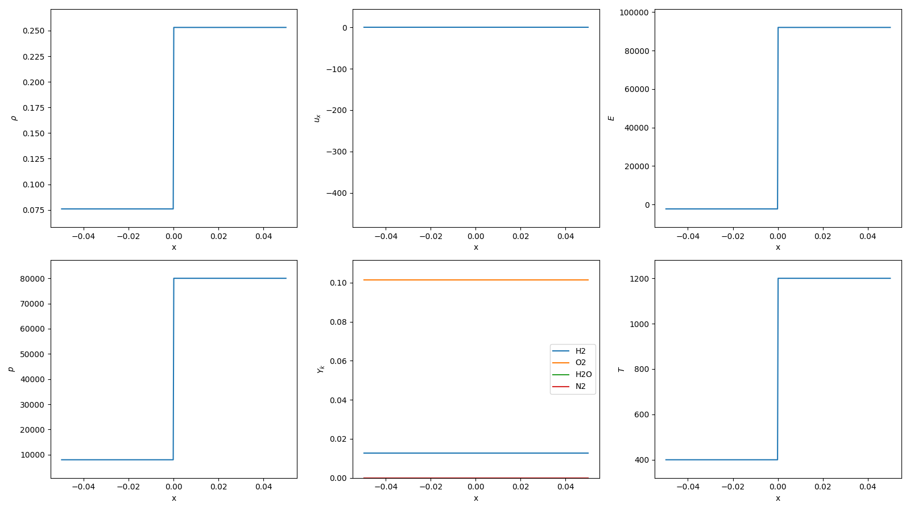

# 1D Multi-Component Inert Shock Tube

References:
> R. P. Fedkiw, B. Merriman, and S. Osher, “High Accuracy Numerical Methods for Thermally Perfect Gas Flows with Chemistry”, J. Comput. Phys., vol. 132, no. 2, pp. 175–190, Apr. 1997. Accessed: Oct. 14, 2024. [Online]. Available: https://doi.org/10.1006/jcph.1996.5622

> P. J. Martínez Ferrer, R. Buttay, G. Lehnasch, and A. Mura, “A detailed verification procedure for compressible reactive multicomponent Navier–Stokes solvers”, Comput. & Fluids, vol. 89, pp. 88–110, Jan. 2014. Accessed: Oct. 13, 2024. [Online]. Available: https://doi.org/10.1016/j.compfluid.2013.10.014

## Initial Condition

## Results

